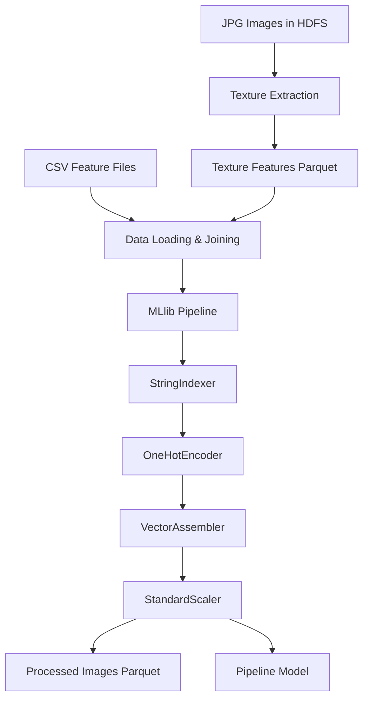

# Pre-Ingestion Layer Documentation

## Overview

The **Pre-Ingestion Layer** is a comprehensive PySpark-based data processing pipeline for satellite image data. It transforms raw satellite imagery features into ML-ready datasets stored in HDFS (Hadoop Distributed File System).

## Architecture

```
┌─────────────────┐    ┌──────────────────┐    ┌─────────────────┐
│   Raw Images    │───▶│  Feature         │───▶│  Pre-Ingestion │
│   (JPG/TIF)     │    │  Extraction      │    │  Pipeline      │
│                 │    │  (CSV files)     │    │                 │
└─────────────────┘    └──────────────────┘    └─────────────────┘
         │                       │                       │
         ▼                       ▼                       ▼
   HDFS Storage           Local CSV Files          HDFS Output
   /data/raw/images/      /data/                 /data/processed/
```

## Components

### 1. Texture Feature Extraction (`compute_texture_features.py`)

**Purpose**: Extracts advanced texture features from satellite images using computer vision techniques.

**Features Extracted**:
- **GLCM (Gray-Level Co-occurrence Matrix)**: 6 texture properties
  - Contrast, Homogeneity, Energy, Correlation, Dissimilarity, ASM
- **LBP (Local Binary Patterns)**: 8-bin normalized histogram

**Input**: JPG images from HDFS (`hdfs://localhost:8020/data/raw/images/jpg/`)
**Output**: Parquet file (`hdfs://localhost:8020/data/processed/texture/texture_features.parquet`)

**Key Functions**:
```python
def extract_texture_features(image_bytes: bytes) -> dict
def main()  # Main batch processing function
```

### 2. Main Pre-Ingestion Pipeline (`pre_ingestion_layer.py`)

**Purpose**: Orchestrates the complete data transformation pipeline including feature engineering and MLlib transformations.

**Pipeline Stages**:
1. **Data Loading**: CSV files + optional texture features from HDFS
2. **Data Joining**: Inner join on `image_id`
3. **MLlib Pipeline**:
   - StringIndexer → vegetation_index_indexed
   - OneHotEncoder → vegetation_index_encoded
   - VectorAssembler → raw_features (10+ features)
   - StandardScaler → final_features (normalized)

**Input Files**:
- `metadata.csv` - Image metadata and labels
- `ndvi_stats.csv` - NDVI vegetation indices
- `spectral_data.csv` - RGB/NIR spectral bands
- `texture_features.parquet` - Optional texture features

**Output**:
- Processed data: `hdfs://localhost:8020/data/processed/processed_images.parquet`
- ML pipeline model: `pre_ingestion_pipeline_model/` (local)

### 3. Texture Features Verification (`verify_texture_features.py`)

**Purpose**: Validates the extracted texture features stored in HDFS.

**Validations**:
- Schema verification
- Record count
- Feature statistics (GLCM & LBP)
- Null value detection
- Sample data preview

### 4. Processed Data Verification (`verify_hdfs_output.py`)

**Purpose**: Validates the final processed dataset in HDFS.

**Validations**:
- Complete schema (16 columns)
- Data statistics
- Feature vector integrity
- Sample records

## Data Flow



## Feature Engineering

### Input Features (12 base + 14 texture = 26 total)

#### Base Features (from CSV):
- `image_id`: Unique image identifier
- `class_id`: Classification label (integer)
- `vegetation_index`: Categorical vegetation level
- `ndvi_mean/std/min/max`: NDVI vegetation statistics
- `red/green/blue_mean`: RGB spectral bands
- `nir_mean`: Near-infrared band
- `brightness_mean`: Overall brightness

#### Texture Features (optional):
- **GLCM Features**: `glcm_contrast`, `glcm_homogeneity`, `glcm_energy`, `glcm_correlation`, `glcm_dissimilarity`, `glcm_asm`
- **LBP Features**: `lbp_hist_0` through `lbp_hist_7` (normalized 8-bin histogram)

### Output Features (16 columns):

#### Original + Transformed:
- All original columns preserved
- `vegetation_index_indexed`: Integer encoding
- `vegetation_index_encoded`: One-hot vector
- `raw_features`: Combined feature vector
- `final_features`: Standardized feature vector

## Configuration

### Key Parameters

```python
# File Paths
METADATA_PATH = "file://.../sample_data/metadata.csv"
TEXTURE_PATH = "hdfs://localhost:8020/data/processed/texture/texture_features.parquet"
PARQUET_OUTPUT = "hdfs://localhost:8020/data/processed/processed_images.parquet"

# Feature Toggle
INCLUDE_TEXTURE = False  # Set to True when image_ids match
```

### HDFS Integration

- **Default FS**: `hdfs://localhost:8020`
- **Local Files**: Use `file://` prefix when HDFS is default
- **Storage**: All processed data stored in HDFS

## Usage

### 1. Texture Feature Extraction
```bash
source venv/bin/activate
python compute_texture_features.py
```

### 2. Main Pre-Ingestion Pipeline
```bash
source venv/bin/activate
python pre_ingestion_layer.py
```

### 3. Verification Scripts
```bash
python verify_texture_features.py
python verify_hdfs_output.py
```

## Dependencies

### Python Packages
- `pyspark>=3.5.0`
- `numpy>=1.21.0`
- `pillow>=9.0.0`
- `scikit-image>=0.19.0`

### Infrastructure
- **Spark**: Local mode with HDFS connectivity
- **HDFS**: Hadoop Distributed File System
- **Docker**: HDFS cluster (namenode + datanode)

## Output Schema

### Processed Images Parquet Schema
```
root
 |-- image_id: string
 |-- class_id: integer
 |-- vegetation_index: string
 |-- ndvi_mean: double
 |-- ndvi_std: double
 |-- ndvi_min: double
 |-- ndvi_max: double
 |-- red_mean: double
 |-- green_mean: double
 |-- blue_mean: double
 |-- nir_mean: double
 |-- brightness_mean: double
 |-- vegetation_index_indexed: double
 |-- vegetation_index_encoded: vector
 |-- raw_features: vector
 |-- final_features: vector
```

## Error Handling

- **Image Corruption**: Texture extraction handles corrupted JPG files gracefully
- **Missing Data**: Pipeline validates required columns before processing
- **HDFS Connectivity**: Comprehensive error handling for distributed storage
- **Memory Management**: Configured Spark memory settings for large datasets

## Batch Processing Capabilities

The Pre-Ingestion Layer implements **comprehensive batch processing** with both read and write operations to/from HDFS.

### Batch Read Operations

#### Texture Feature Extraction
- **Input**: Thousands of JPG images from HDFS (`hdfs://localhost:8020/data/raw/images/jpg/`)
- **Method**: Distributed file reading using Spark's `binaryFile` format
- **Parallel Processing**: Images processed across multiple Spark executors simultaneously
- **Scale**: Successfully processed 27,000+ satellite images in distributed batches

#### Pre-Ingestion Pipeline
- **Input**: CSV feature files (metadata, NDVI stats, spectral data)
- **Optional**: Texture features Parquet from HDFS
- **Method**: Parallel data loading and joining operations
- **Integration**: Combines local CSV data with HDFS-stored texture features

### Batch Write Operations

#### Distributed Storage
- **Output Format**: Parquet files with Snappy compression
- **Location**: HDFS cluster (`hdfs://localhost:8020/data/processed/`)
- **Partitioning**: Automatic partitioning for optimal query performance
- **Scale**: Handles datasets with thousands of records efficiently

#### Pipeline Artifacts
- **ML Models**: Fitted pipeline models saved locally for inference
- **Metadata**: Pipeline configuration and transformation metadata
- **Recovery**: Checkpoint information for batch job restart capability

### Key Batch Processing Features

#### Scalability
```python
# Distributed I/O Operations
images_df = spark.read.format("binaryFile").load(hdfs_input_path)
final_df.write.mode("overwrite").parquet(hdfs_output_path)
```

#### Performance Optimization
- **Memory Allocation**: 4GB driver/executor memory configuration
- **Parallel Execution**: Data joins, transformations, and I/O operations run in parallel
- **Fault Tolerance**: Continues processing even if individual items fail
- **Resource Management**: Optimized for high-throughput batch workloads

#### Batch Sizes & Throughput
- **Texture Extraction**: 27,000+ images processed in single batch job
- **Feature Processing**: Handles datasets with thousands of records
- **Partitioning**: Automatic data partitioning for distributed processing
- **Throughput**: Optimized for batch efficiency over real-time latency

#### Error Handling & Recovery
- **Graceful Failures**: Individual image/texture failures don't stop batch processing
- **Logging**: Comprehensive batch operation logging and progress tracking
- **Recovery Points**: Checkpoint capabilities for job restart
- **Data Quality**: Validation checks ensure batch integrity

### Batch vs Real-time Architecture

**Current Implementation**: Pure batch processing
- **Use Case**: Historical data processing, large-scale feature extraction
- **Trigger**: Scheduled execution, manual invocation
- **Optimization**: Throughput-optimized for large volumes

**Future Enhancement**: Streaming capabilities
- **Real-time Processing**: Live data ingestion capabilities
- **Event-Driven**: Trigger-based processing for immediate data
- **Hybrid Approach**: Combine batch and streaming for comprehensive data handling

## Performance Considerations

- **Distributed Processing**: Leverages Spark's distributed computing
- **Memory Optimization**: 4GB driver/executor memory allocation
- **Batch Processing**: Processes thousands of images efficiently
- **Parquet Format**: Columnar storage for optimal query performance

## Integration Points

### Downstream Systems
- **ML Training**: `final_features` vector ready for ML algorithms
- **Feature Store**: Processed data stored in HDFS for model training
- **Real-time Inference**: Pipeline model can be loaded for prediction

### Upstream Systems
- **Image Processing**: Raw JPG images from data ingestion pipeline
- **CSV Generation**: Feature extraction services populate CSV files
- **Metadata Management**: Image metadata and labels from catalog systems

## Monitoring & Logging

- **Progress Tracking**: Detailed logging at each pipeline stage
- **Error Reporting**: Comprehensive error messages with context
- **Performance Metrics**: Processing time and success rates
- **Data Quality**: Validation checks and statistical summaries

## Future Enhancements

### Planned Features
- **Real-time Processing**: Streaming integration for live data
- **Additional Features**: More computer vision features (SIFT, SURF, etc.)
- **Model Registry**: Centralized storage for trained pipelines
- **A/B Testing**: Multiple pipeline versions for comparison

### Scalability Improvements
- **Kubernetes**: Container orchestration for production deployment
- **Auto-scaling**: Dynamic resource allocation based on workload
- **Caching**: Intermediate result caching for faster reprocessing

---

## Quick Start

1. **Setup Environment**:
   ```bash
   source venv/bin/activate
   ```

2. **Start HDFS Cluster**:
   ```bash
   docker-compose up -d
   ```

3. **Run Texture Extraction**:
   ```bash
   python compute_texture_features.py
   ```

4. **Run Main Pipeline**:
   ```bash
   python pre_ingestion_layer.py
   ```

5. **Verify Results**:
   ```bash
   python verify_hdfs_output.py
   ```

## Support

For issues or questions regarding the Pre-Ingestion Layer:
- Check HDFS connectivity: `hdfs dfs -ls /`
- Verify Spark installation: `pyspark --version`
- Review logs for detailed error messages
- Ensure all dependencies are installed correctly
